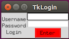
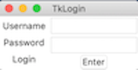

# TkLogin - A python Tkinter login
  
---

This is a module of autentication written in Python. The app verifies that you have the right to access by cross-checking your credentials in a database. To have a successful login and as you can see from the [database](TkLogin/Data/Users_Database.json), the only active account is:

- Username: TkLogin
- Password: 000000

## Installation:

You can easily install the python modules with: 

**pip install TkLogin**

Once installed, to run it just type on Terminal/command-promp **"TkLogin"** and a window as below should appear:

---

Example with Linux Ubuntu

---

Example with MacOS:

---

Enjoy! 

